[](https://marketplace.visualstudio.com/items?itemName=niudai.zhihu)
[](https://marketplace.visualstudio.com/items?itemName=niudai.zhihu)
[](https://marketplace.visualstudio.com/items?itemName=niudai.zhihu)


<p align="center">
  <br />
  <a title="Learn more about GitLens" href="https://gitlens.amod.io"></a>
</p>


# 👽 Zhihu On VSCode

基于 VSCode 的知乎客户端提供包括阅读，搜索，创作，发布等一站式服务，内容加载速度比 Web 端更快，创新的 Markdown-Latex 混合语法让内容创作者更方便地插入代码块，数学公式，并一键发布内容至知乎平台。

## ⚡ Features

- 登录
  - [二维码/账密登录](#login)
- 浏览  
  - [个性推荐](#feed)
  - [实时热榜](#hot-story)
  - [搜索全站](#search)
  - [收藏夹](#collect)
- 创作
  - [内容创作](#write)
  - [内容发布](#publish)
  - [一键上传图片](#picture-upload)

## 📃 Reference

- [图标按钮](#icons)

## 🔑 登录
<a name = "login"></a>

进入主页面，左侧最上方栏为个人中心，点击登录图标，或使用 `Ctrl + Shift + P` 打开命令面板，搜索并执行 `Zhihu: Login` 命令。

选择登录方式：

### 二维码

选择二维码登陆后，会弹出二维码页面，打开知乎 APP，扫码后点击确认登录：

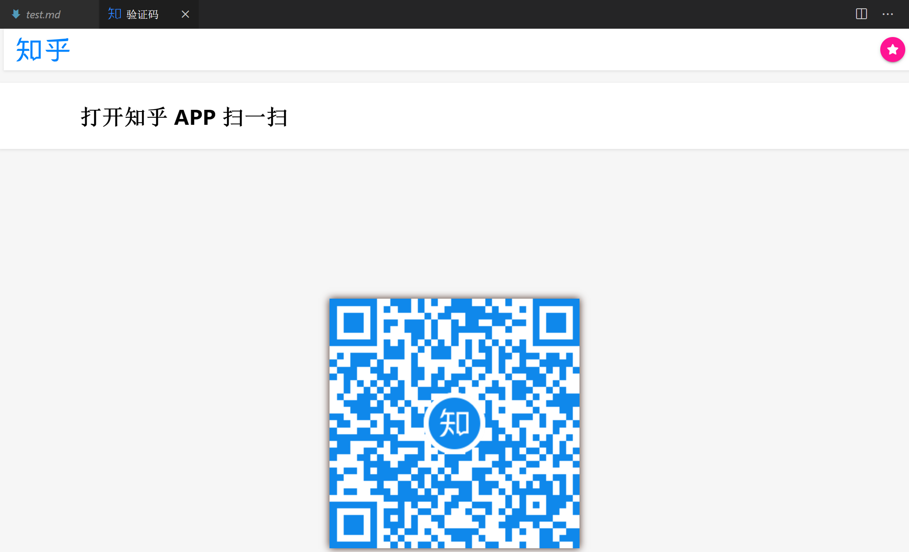

### 账号密码

视情况，插件会加载并显示验证码，提示你输入验证码，输入后，再依次根据提示输入手机号和密码即可。

登录成功后会有问候语，推荐栏会自动刷新出你的个性签名和头像：

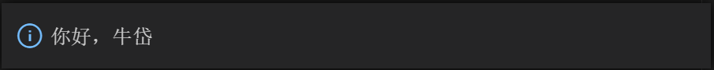


# 

## 🎭个性推荐

登陆成功后，个性推荐板块会自动刷新，提供你的个性推荐内容：

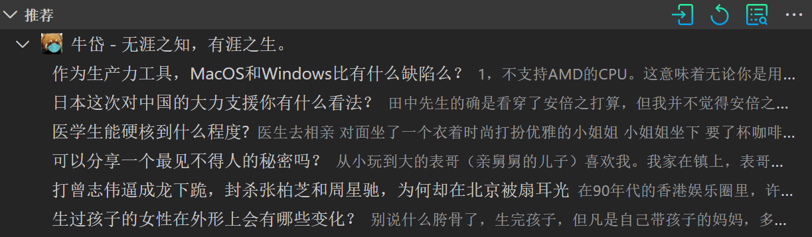

内容可能为答案，问题，或文章，点击条目，就会打开VSCode知乎页面：

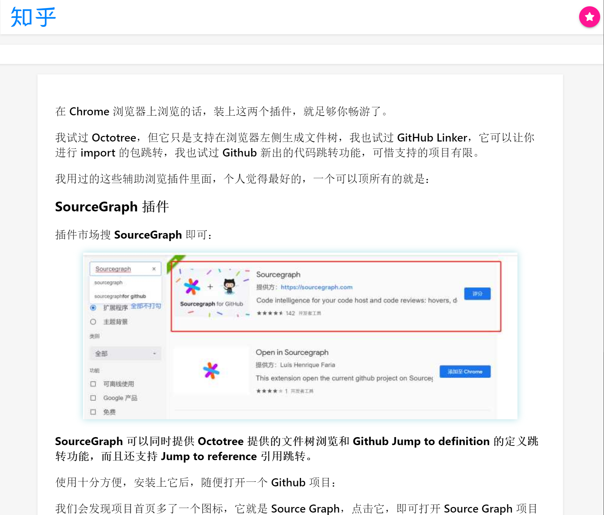

#

## 🔎 搜索 

<a name = "search"></a>
点击搜索按钮，或搜索命令 `Zhihu: Search Items`，搜索全站知乎内容：

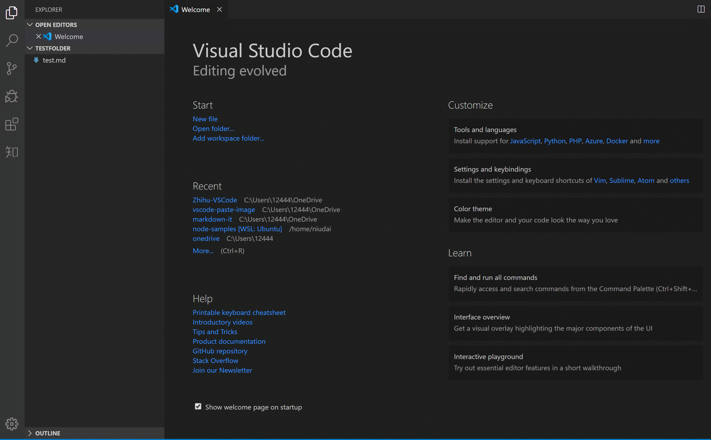

#

## 📩 内容创作
<a name = "write"></a>

新建一个后缀名为`.md`的文件，若不需要数学公式，只需要按照你最熟悉的 Markdown 语法写即可，右键点击 `Zhihu: Preview` 可预览答案:


### Latex 语法支持

为了更好地支持数学公式的写作，知乎定制的 Markdown 转换器提供了 Latex 语法拓展，语法示例：

```
$$
  |\vec{A}|=\sqrt{A_x^2 + A_y^2 + A_z^2}.
$$
```

用 `$$` 包围的部分会被当做 latex 语言进行解析，生成知乎的数学公式 svg，比如上方的数学公式发布至知乎会生成如下公式:

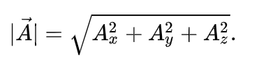

代码块：

记得声明语言标签, 这样发布至知乎的答案才能获得正确的语法高亮，示例如下：

    ```java
    public class Apple {
      public Apple() {}
    }
    ```

发布后会提供 java 的语法高亮:

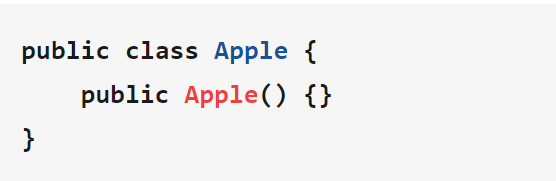

>由于知乎服务端的限制，表格暂不支持，答案中的表格会被服务端过滤。

## 内容发布
<a name = "publish"></a>

### 链接扫描 😊

若你想在特定的问题下回答，或想修改自己的某个原有回答，就将问题/答案链接以 `#! https://...` 的格式放置于答案的第一行，发布时，插件会自动扫描识别，发布至相应的问题下，或修改原有的答案。

比如，你想在 [轻功是否真的存在，其在科学上可以解释吗？](https://www.zhihu.com/question/19602618) 该问题下回答问题, 只需将

```
#! https://www.zhihu.com/question/19602618
```

若是你已经创作过的答案, 则将答案的链接, 形如:

```
#! https://www.zhihu.com/question/355223335/answer/1003461264
```

的链接复制至文件顶部即可。

若插件没有在首行扫描到链接，则会询问创作者接下来的操作，你可以选择发布新文章，或从收藏夹中选取相应问题，发布至相应问题下：

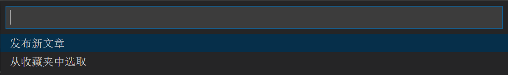

### 发布文章

选择发布文章后，会继续提示你输入文章标题，输入完成后，按下回车，当前的文档就会以文章的形式发布至你的账号。

### 从收藏夹中选取

>关于如何管理收藏夹，请移至 [收藏夹](#collect)。

插件会提示选择你收藏过的问题：

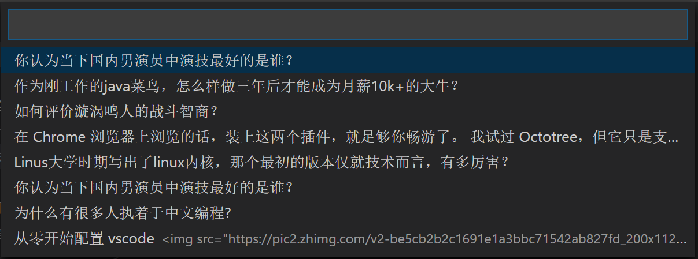

选择后，答案就会发布至相应的答案下（若已在该答案下发布过问题，请用顶部链接的方式来发布！)。

#

## 🎫收藏夹
<a name = "collect"></a>

### ➕ 添加收藏

不管是文章，答案，还是问题，在知乎页面顶栏的右侧，都会看到一个粉色的星状图标：

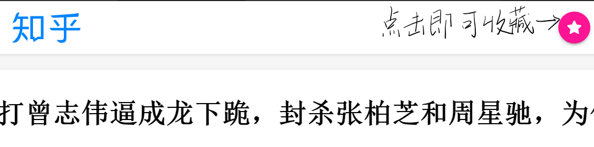

### ➖ 查看收藏

收藏的内容会在左侧下方显示，插件会自动分类：

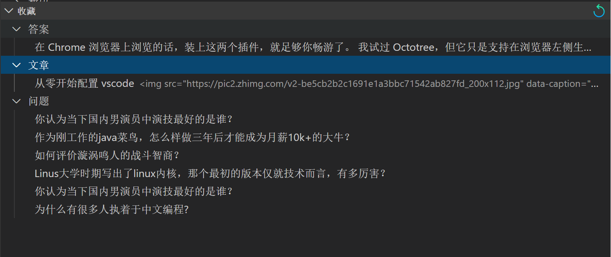

### ✖ 删除收藏

鼠标移至相应的行，会出现叉状图标，点击即可删除：

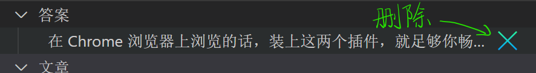

#

## 上传图片

一篇优质的答案，离不开图片，知乎插件提供了两种非常便携的图片上传方式，比 Web 端的插入图片更加便携高效，且在图片上传的时候自动在当前 Markdown 光标所在行自动生成图片链接，无需创作者手动管理，Windows，MacOS，Linux 全部兼容。

### 从粘贴板上传图片

调用 `Zhihu: PasteImage` 命令，自动将系统粘贴板中的图片上传至知乎图床，并生成相应链接。

快捷键为 `ctrl+shift+alt+p`，也可以通过打开命令行面板搜索命令。

### 复制文件路径上传

将文件的路径复制至剪贴板，再调用 `Zhihu: PasteImageFromPath` 命令，插件会自动将该路径的文件上传至知乎图床，生成链接。

## 😀 图标按钮

<a name = "icons"></a>

点击左侧活动栏的知乎按钮，进入知乎插件页面，在推荐的上方可以看到三个按钮，对应的命令分别为`Zhihu: Login`（登录），`Zhihu: Refresh`（刷新）, `Zhihu: Search`（搜素）。

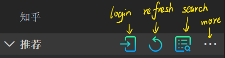

最右侧的更多栏点开，可以看到 `Zhihu: Logout`(注销) 命令按钮:


在 Markdown 页面内，可以在编辑窗口的右上角看到两个按钮：

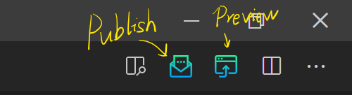

左侧的为 `Zhihu: Publish`（发布答案），右侧的为 `Zhihu: Preview` (预览答案)。

