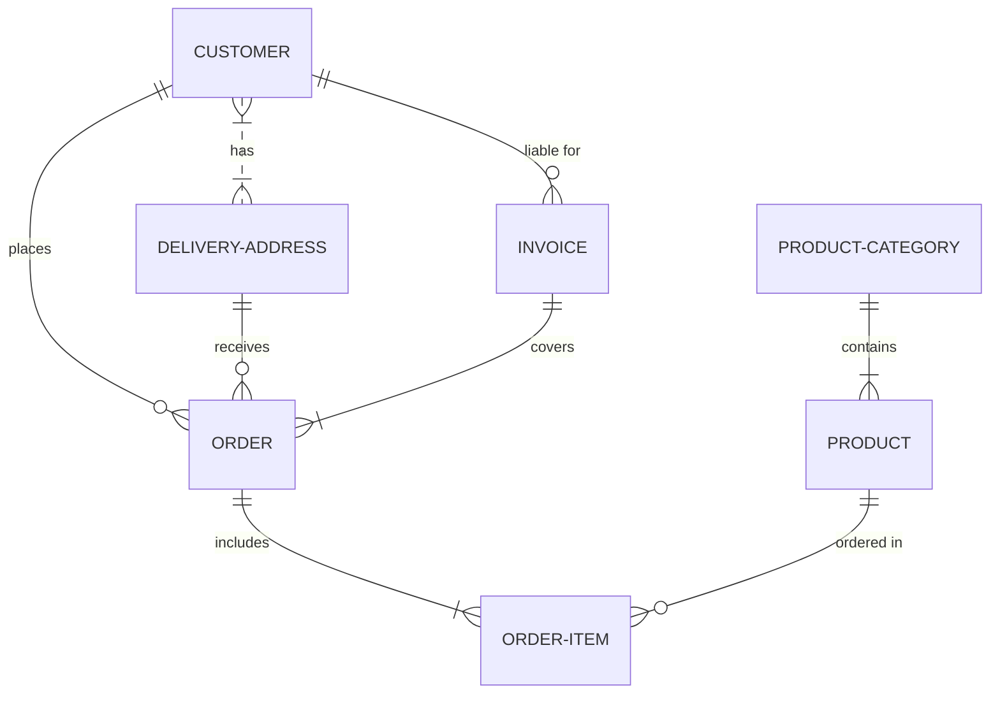

# Zhihu On VSCode 0.5.0

## mermaid 支持

支持预览，上传 mermaid 图片至知乎，支持设置 mermaid 图片主题。

mermaid 转化为图片借助了提供的 [mermaid live editor](https://mermaid.live/edit) 在线图片下载，所以发布文章的时候需要较长时间的等待，是不稳定的功能，故设计为需要将 zhihu.enableMermaidToPng 设置为 true 才能使用该功能。

```json
{
    "zhihu.enableMermaidToPng": true,
    "zhihu.mermaidTheme": "dark" // 支持设置 mermaid 图片主题，默认值是 "default"
}
```

### 示例

> imageName 或者 image 会被识别为题图




## 知乎表格支持

> 直接在本地书写 markdown 即可，`row-style` 默认使用"striped"，行首，列首是灰色，隔行是灰色 。

### 示例

| 1   | 2   | 3   |
| --- | --- | --- |
| 4   | 5   | 6   |
| 7   | 8   | 9   |
| 10  | 11  | 12  |

| 一  | 二  | 三  |
| --- | --- | --- |

| 知乎表格 row-style | 效果|
| --- | --- |
| normal | 行首是灰色|
| striped | 行首，列首是灰色，隔行是灰色 |


## bug 修复

#107 用户信息 undefined

## 其他

移除 Zhihu On VSCode 的 markdown 预览按钮，并入 vscode 的预览。
